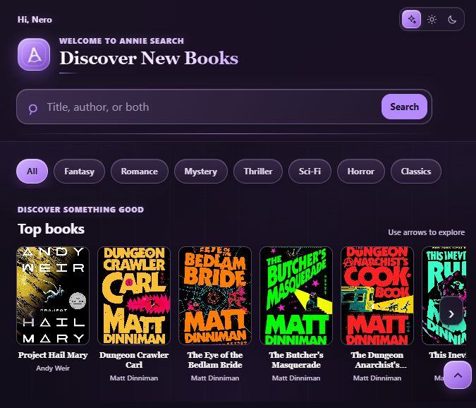

# 📚 Annie Search

### A Telegram book search and discovery bot

Search for books by title, author, or ISBN, explore personalized recommendations, and save books to a synced personal Bookshelf in Annie’s Mini App.

<p align="center">
  <a href="https://t.me/AnnieBooks_bot"><strong>Open @AnnieBooks_bot</strong></a>
</p>



<p align="center">
  
  
  
  
</p>

---

## About Annie Search

Annie Search helps readers find books and decide what to read next. Use the bot directly in Telegram or open the Mini App for visual search, current trending shelves, full book details, and recommendations based on books you’ve read or liked, genres, and mood.

## Highlights

- 🔎 Search by book title, author, or ISBN
- 💬 Search inline from any chat with `@AnnieBooks_bot`
- 📚 Browse recently trending books and genre shelves
- ✨ Get recommendations from reading preferences, genres, and moods
- 📖 Open full book details with covers, ratings, genres, language, ISBN, pages, publication date, and description when available
- 🌐 Discover books across catalog languages and translate non-English descriptions into English
- 🪄 Explore a **More Like This** shelf based on genre and book relevance
- 📤 Share a book in a Telegram chat using inline results
- 🎨 Choose Purple, Light, or AMOLED Dark appearance in the Mini App
- 📚 Keep separate My Books and Favourites lists synced to your Telegram account
- 🔍 Search, sort, and switch between grid and list views independently in My Books and Favourites
- 🗑️ Remove one book or select several for bulk removal

## Book sources

Annie combines data from different catalogs depending on the feature:

| Feature | Sources |
|---|---|
| Bot search | Google Books and iTunes, with Hardcover ratings and a Goodreads fallback when the main catalogs return no results |
| Mini App search | Hardcover, with iTunes and Google Books used for search or metadata enrichment |
| Recommendations | Hardcover and Google Books, with Open Library and optional Big Book API results for additional discovery |

Results and metadata vary by catalog. Some titles may have more complete details or covers than others.

## Language support

- **Project language:** Python 3.12
- **Book catalogs:** Search can return English and other catalog-language editions.
- **Mini App interface:** English.
- **Description translation:** The Mini App detects non-English descriptions locally and offers translation to English. Configure Azure Translator to enable the translation service.

## Telegram commands

| Command | What it does |
|---|---|
| `/start` | Welcome message and Mini App launch button |
| `/help` | Commands and usage tips |
| `/search <query>` | Search by title, author, or ISBN |
| `/portal` | Open Annie Search Mini App |
| `/recom` | Open the recommendations screen directly |
| `/bookshelf` | Open My Bookshelf directly |
| `/favorites` | Open the Favourites tab directly |
| `/ping` | Check whether the bot is responding |

The bot publishes these commands to Telegram on startup, so no `/setcommands` setup is needed. You can still override the command menu in [@BotFather](https://t.me/BotFather). Enable Inline Mode in BotFather to use inline search. The published commands are:

```text
start - Show welcome message
help - Show help and usage guide
search - Search for books
portal - Open the Annie Search Mini App
recom - Open recommendations directly
bookshelf - Open My Bookshelf
favorites - Open Favourites
ping - Check whether the bot is responding
```

The bot owner can also use `/authorize <telegram_user_id>`, `/unauthorize <telegram_user_id>`, and `/admins` to manage users who are exempt from search cooldowns and temporary blocks. These commands appear in the owner’s command menu and are enforced as owner-only by the bot. The allowlist is stored in the separate `bot_admins` collection in MongoDB, so `MONGODB_URI` must be configured; it is loaded into memory at startup and changes made by the owner update the cache immediately. The bot checks this in-memory list during normal operation, with a brief refresh only when a restriction check needs to confirm an exemption.

Inline search works in chats that support it:

1. Type `@AnnieBooks_bot Dune` in the message field.
2. Choose a book result.
3. Send it to the chat or open its details.

To launch the Mini App inline, type `@AnnieBooks_bot .portal` or `@AnnieBooks_bot .recom` and tap the launch button above the results.

## Quick start

### Requirements

- Python 3.12 or newer
- A Telegram bot token from [@BotFather](https://t.me/BotFather)
- Optional API keys for enhanced catalog data and translation

### Run locally

```bash
git clone https://github.com/Devil-breaker/books-search-bot.git
cd books-search-bot
python -m venv .venv
```

Activate the environment, then install dependencies and create your settings file:

```bash
# Windows PowerShell
.venv\Scripts\Activate.ps1
Copy-Item env.example .env

# macOS / Linux (use these instead of the two commands above)
# source .venv/bin/activate
# cp env.example .env
```

Set `TELEGRAM_BOT_TOKEN` in `.env`, then start the bot:

```bash
pip install -r requirements.txt
python goodreads_bot.py
```

The polling entry point starts both the Telegram bot and the Flask server that serves the Mini App at `/miniapp/`. The `/start` menu includes direct launch buttons for the Portal, Recommendations, My Bookshelf, and Favourites.

## Deploy on Koyeb

The repository’s Dockerfile runs the polling bot and Mini App web server together.

1. Create a Koyeb service from this GitHub repository using the **Dockerfile** builder.
2. Add the environment variables listed below in the service settings.
3. Expose the service’s HTTP port as `8080`, or use the same port configured in `PORT`.
4. Set `ANNIE_APP_URL` to the public HTTPS address ending in `/miniapp/`, such as `https://<your-service>.koyeb.app/miniapp/`.
5. Deploy the service, then use `/portal` in Telegram.

Koyeb terminates HTTPS at its edge; the Flask server listens for plain HTTP on `0.0.0.0:$PORT` inside the container.

## Configuration

Copy `env.example` to `.env` for local use. In production, add values through your hosting provider’s secret or environment-variable settings.

| Variable | Required | Purpose |
|---|---:|---|
| `TELEGRAM_BOT_TOKEN` | Yes | Telegram bot authentication |
| `ANNIE_APP_URL` | For Mini App | Public HTTPS Mini App URL, ending in `/miniapp/` |
| `MONGODB_URI` | Optional | MongoDB Atlas connection string for Bookshelf sync and the bot-admin allowlist |
| `MONGODB_DB_NAME` | Optional | Database name; defaults to `annie_db` |
| `GOOGLE_BOOKS_API_KEY` | No | Higher Google Books API quota |
| `HARDCOVER_API_KEY` | No | Hardcover catalog search, trending, and community ratings |
| `AZURE_TRANSLATOR_KEY` | No | Translate non-English descriptions into English |
| `AZURE_TRANSLATOR_REGION` | Sometimes | Azure Translator region, if required for your resource |
| `BIGBOOK_API_KEY` | No | Extra recommendation candidates from Big Book API |
| `BIGBOOK_API_DAILY_BUDGET` | No | Daily request ceiling for Big Book API; defaults to `45` |
| `OPEN_LIBRARY_CONTACT_EMAIL` | No | Contact information for Open Library requests |
| `BOT_OWNER_ID` | No | Telegram user ID that can manage the authorized-user allowlist and is exempt from search restrictions |

The Mini App can show cached and provider-backed features without every optional key, but missing provider keys can reduce coverage. Keep real credentials out of Git and never put them in the README.

### Enable bookshelf sync

Create a MongoDB Atlas database user and cluster, then set `MONGODB_URI` to its connection string in local `.env` or Koyeb environment variables. Add the bot host to the cluster's network access list. The app creates its `bookshelf_users` collection on the first bookshelf change; no manual schema or index setup is required. Leave `MONGODB_URI` empty to use the browser's temporary, per-user cache instead.

The bookshelf allows up to **100 unique books per Telegram user across both tabs**. Favourites and My Books share this limit, and moving a book between them does not create another entry. Each user is stored in one bounded document; adding or moving a book is one atomic database write, removing selected books is one write, and opening the bookshelf reads the saved document once (then reuses it for 30 seconds). Searches, sorting, filtering, and switching tabs do not query MongoDB. Book descriptions are stored with a size limit so opening the same saved book does not repeatedly request its full catalog details.

## Project structure

```text
.
├── goodreads_bot.py              # Polling entry point and Flask Mini App server
├── src/
│   ├── handlers.py               # Telegram commands, inline search, and callbacks
│   ├── aggregator.py             # Search and book metadata providers
│   └── miniapp/
│       ├── routes.py             # Mini App API routes
│       ├── service.py            # Search, details, trending, and related books
│       ├── recommendations.py    # Separate recommendation module
│       └── static/               # Mini App UI, styles, scripts, and images
├── api/                          # Optional Telegram webhook entry points
├── tests/                        # Automated test suite
├── Intro.png                     # README Mini App preview
├── Dockerfile
├── requirements.txt
└── env.example
```

## Tests

Run the test suite with:

```bash
python -m unittest discover -s tests
```

## License

Annie Search is released under the [MIT License](LICENSE).

---

<p align="center">Made with ❤️ for readers · <a href="https://t.me/AnnieBooks_bot">@AnnieBooks_bot</a></p>
